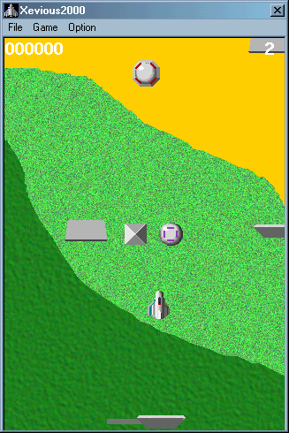



## Xevious 2001

### Description

This is my new version of famous Namco game! Insiode you can find an arcade Game Engine that is directly usable as ActiveX
 
### More Info
 
To limit the download size I have publisched only 1 level. The complete game can be found at http://members.xoom.com/denzissimo

             |
---                |---
**Submitted On**   |2001-04-03 18:07:20
**By**             |[N/A](https://github.com/Planet-Source-Code/PSCIndex/blob/master/ByAuthor/empty.md)
**Level**          |Advanced
**User Rating**    |4.8 (24 globes from 5 users)
**Compatibility**  |VB 6\.0
**Category**       |[Games](https://github.com/Planet-Source-Code/PSCIndex/blob/master/ByCategory/games__1-38.md)
**World**          |[Visual Basic](https://github.com/Planet-Source-Code/PSCIndex/blob/master/ByWorld/visual-basic.md)
**Archive File**   |[Xevious 2017888442001\.zip](https://github.com/Planet-Source-Code/xevious-2001__1-22126/archive/master.zip)

